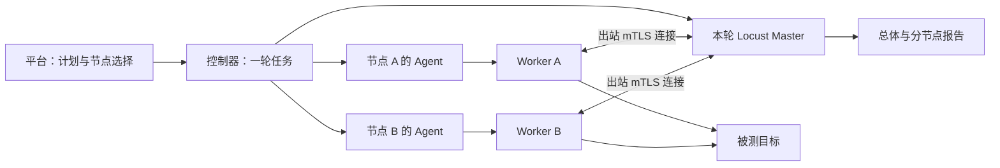

# 多节点并发压测首期方案

日期：2026-09-22。状态：用户已确认，首期代码与隔离验收完成，0.4.0 发布及本机激活见验收记录。

用户已确认按 **2–5 个节点、总并发最多 1000 个虚拟用户** 规划。继续支持单节点。用户已授权按本方案实施。1000 是配置上限，不是已测得的容量或 RPS 保证；真实机器和容量验收单独记录。

本方案细化 [原分布式性能测试设计](2026-09-15-distributed-performance-testing.md) 的多节点阶段，保留已有平台、独立控制器、Locust Master、节点 Agent/Worker 架构。现有运行版本为 Agent 0.3.2、协议 2、快照 2、Locust 2.43.3；这些是实施前的代码基线；本次升级至 Agent 0.4.0、协议与快照 3。

## 1. 首期交付边界

一次正式压测选择若干节点，共同执行同一个冻结的计划；总用户数由同一个 Master 分配，所有节点准备完成后协调开始，统一停止，产出一份总体报告及分节点结果。

| 项目 | 首期约定 |
| --- | --- |
| 节点数量 | 每轮 1–5 台；主要验收 2–5 台 |
| 虚拟用户数 | 整轮总量，1–1000；不得少于所选节点数 |
| 每秒启动用户数 | 整轮总量，沿用当前最大 100，不按节点倍增 |
| 执行时长 | 沿用 1–600 秒，从开始加压计时，包含爬坡；准备时间不计入 |
| 用户等待时间 | 沿用现有含义及范围；每个用户按自己的步骤和等待配置运行 |
| 分配方式 | 自动均分，余数按冻结的节点顺序分配；首期不支持手动权重 |
| 节点内部进程 | 每节点一个 Worker 进程；节点可模拟多个虚拟用户 |
| 同时运行的任务 | 全平台仍一次执行一轮，其余排队；一轮内部多节点并发 |
| 单用户验证 | 一次一个节点，一个用户执行一次完整流程 |
| 故障策略 | 任一参与节点运行故障，整轮停止并标记不完整 |

首期不增加运行中扩缩容、失联自动补位、节点故障转移、多轮同时发压、单节点多 Worker 进程、账号池分片、阶梯负载或跨节点时钟同步。节点安装、目标批准和项目权限继续使用现有流程。

## 2. 用户会看到的页面

### 2.1 编辑计划

四个负载参数保留在计划中，用户数和启动速率明确标成“总虚拟用户数”“总每秒启动用户数”。说明文案例如：

> 总用户数由本轮所有参与节点共同承担。例如 1000 个用户分到 3 个节点，为 334、333、333 个。每秒启动 100 个用户也指所有节点合计。执行时长包含逐步启动用户的时间。

节点在每次执行时选择，不写死在计划里；执行记录冻结本轮选择和分配结果。这样同一计划可以在不同节点组合上运行，历史记录仍能准确追溯。

若 `用户数 ÷ 启动速率 ≥ 执行时长`，显示“预计在本轮结束前无法形成持续的满负载阶段，请增加时长或启动速率”。这是提示，不把已存在的合法计划突然判为无效。报告展示实际用户数曲线，不把目标用户数当作已达到的并发。

### 2.2 单用户验证弹窗

保持单选节点。节点行显示在线情况、版本是否兼容和当前计划的验证状态；离线或待升级节点不可执行验证。验证详情继续显示逐步骤请求、响应、变量提取和断言结果。

验证成功只对该节点、相同请求配置和相同执行版本有效，不能用 A 节点的成功记录替 B 节点放行。修改用户数、启动速率、时长等负载参数不单独使脚本验证失效；请求、断言、变量、目标或节点运行版本变化会使其失效。

### 2.3 正式压测弹窗

把现有单选节点改为复选列表；默认保留一个可执行节点，不自动选中全部机器。没有可执行节点时保持空选并给出原因。

示意（计划配置 1000 用户、每秒启动 100 用户、运行 120 秒）：

| 选择 | 节点 | 在线状态 | 版本 | 当前计划验证 | 预计承担用户数 | 操作 |
| --- | --- | --- | --- | --- | --- | --- |
| 已选 | 节点 A | 在线 | 匹配 | 已通过 | 334 | 查看验证 |
| 已选 | 节点 B | 在线 | 匹配 | 已通过 | 333 | 查看验证 |
| 已选 | 节点 C | 在线 | 匹配 | 未验证 | 333 | 单用户验证 |
| 不可选 | 节点 D | 离线 | 匹配 | 已通过 | — | 查看节点 |
| 不可选 | 节点 E | 在线 | 待升级 | 已过期 | — | 查看升级说明 |

底部摘要：

> 已选 3 个节点，共 1000 用户；全局每秒启动 100 用户，预计约 10 秒达到目标用户数，实际以运行曲线为准。节点 C 尚未通过验证，请先完成验证。

- 在线、兼容但未验证的节点可以选中查看分配；存在此类节点时，“开始正式压测”禁用，并准确列出阻断原因。
- “单用户验证”跳转到现有验证流程，保留正式运行的节点选择；返回或刷新资格后更新状态。首期逐节点验证，不额外做批量验证功能。
- 提交前由后端再次核查全部节点和验证资格；出现变化返回具体节点及原因，不静默移除节点，也不缩减用户数。
- 不足 2 个节点仍允许按单节点运行。超过 5 个节点、重复节点、总用户数小于节点数时明确阻止提交。
- 使用现有执行权限，单次点击进入队列；重复提交相同请求不会创建多轮。准备和排队状态分别显示，不能让用户误以为已开始发压。

### 2.4 执行列表与详情

列表将“节点”展示为节点数量和名称摘要，例如“3 个节点 · A、B、C”。单节点历史记录继续可读；旧版未保存历史名称时展示当前关联名称并说明来源，不声称是运行当时的名称。保留模式、状态、请求量、失败数和时间等现有列。

详情分成三个明确层次：

1. **整轮概况**：计划、参与节点、目标/实际用户数、总启动速率、开始/结束时间、整体状态和完整性。
2. **总体指标与趋势**：请求量、失败数、错误率、平均 RPS、平均响应时间、P95/P99、实际用户数曲线、接口统计。指标可切换“全部节点 / 指定节点”。
3. **节点明细**：每台节点的分配用户数、实际用户数、状态、请求量、错误率、P95、Worker 进程 CPU/RSS、最近报告时间、停止确认和失败原因。点击节点查看其接口统计和有限失败样本。

示意：

| 节点 | 分配 / 当前用户 | 状态 | 请求数 | 错误率 | P95 | 停止确认 | 统计完整 |
| --- | --- | --- | --- | --- | --- | --- | --- |
| A | 334 / 0 | 已停止 | 示例 | 示例 | 示例 | 已确认 | 是 |
| B | 333 / 未知 | 失联 | 示例 | 示例 | 示例 | 等待租约失效 | 否 |
| C | 333 / 0 | 已停止 | 示例 | 示例 | 示例 | 已确认 | 是 |

失联时不能把最后观察到的并发数继续展示为当前值，也不能用 0 代替未知值。总体醒目提示“本轮因节点 B 失联提前停止，结果不完整”，保留已经收到的统计供排查。

停止后保留最后一次资源采样和时间。Agent 的系统 CPU/内存指标与 Worker 进程 CPU/RSS 分开标注；缺失时显示“暂无数据”，不推断容器还剩多少可用容量。

## 3. 负载和业务数据语义

设总用户数为 U、节点数为 N。参与节点按稳定的节点 ID 排序并冻结；前 `U % N` 个节点各分到 `floor(U / N) + 1`，其余分到 `floor(U / N)`。用户看到的预览顺序与冻结结果一致。例如 3 节点 1000 用户为 334/333/333。

只有 Master 调用一次 `start(total_users, total_spawn_rate)`。在固定成员的 Dispatcher 适配中保证最终分配与预览一致，不让各节点分别启动一份完整总负载。每节点启动速率不是独立的用户参数，避免整数拆分和重复发压。

全部 Worker 完成身份握手、版本和任务摘要检查后，控制器才允许 Master 开始。这里保证同一轮协调加压，不承诺不同设备毫秒级同时发送第一条请求。

继续使用现有每用户隔离的变量和 Cookie；准备步骤每个虚拟用户执行一次，主步骤循环执行。内置唯一值生成不能仅依赖进程本地用户序号，应包含本轮和节点/Worker 的维度或使用现有 UUID 方案。固定账号变量会被所有用户共同使用；本期不自动创建不同账号或分配账号池。

## 4. 生命周期与故障处理



1. **创建/排队**：事务内核对全部节点和验证记录，冻结计划、节点集合、分配和版本，生成一条 Run；继续等待全局执行槽位。
2. **准备**：出队时复查节点在线、身份、兼容性及目标批准范围。不得用排队后被编辑的计划覆盖冻结内容。建立 Master、运行 CA 和各节点独立命令。
3. **就绪**：核对预期身份集合，不仅比较 Worker 数量；全部预期节点就绪才开始。准备超时或失败时，本轮不发送业务请求，回收所有已经准备的参与者。
4. **运行**：Master 统一发压；节点集合固定。节点退出、失联、身份改变、被吊销或进程失败时，先停止派发和加压，再停止整轮；不迁移压力、不补位、不自动重跑。
5. **收尾**：停止新请求，等待在途请求结束或被明确终止，接收最终统计；逐节点确认 Worker/隧道退出。界面持续显示“停止中”及未确认节点。
6. **释放**：控制器自己的旧轮监督进程退出，且各节点确认退出或其已下发命令租约可靠失效后，才释放全局槽位。租约失效证明覆盖最后可能续租时刻、15 秒租约、监督进程 5 秒强制终止及调度余量；回收等待超时不等于已证明退出，不能仅因等了 30 秒就无条件释放槽位。

| 场景 | 整轮结果 | 报告处理 |
| --- | --- | --- |
| 准备失败、始终未开始发压 | failed | 展示具体节点原因，不伪造执行指标 |
| 到达时长，统计和停止确认正常 | completed | 完整；存在请求断言失败时照常显示失败数，不称作全部接口通过 |
| 用户主动停止，收尾完整 | cancelled | 提前停止；统计可完整，但不能作为完成既定时长 |
| 用户停止且尾部统计缺失 | cancelled | 标记统计不完整、列出缺失节点和原因 |
| 运行中节点故障或失联 | incomplete | 保留部分结果，整轮停止；即使后续收到统计，也不能改称按计划完成 |
| 正常结束但最终统计有缺口 | incomplete | 明确缺口，不填零、不显示成功 |
| 控制器重启/租约丢失 | failed 或 incomplete | 依是否开始发压区分，回收整轮；不恢复旧轮发压 |

业务接口超时、HTTP 错误和断言失败计入请求失败统计，沿用当前步骤控制规则，不等同于节点失联。并发发生“节点故障”和“用户停止”时，通过父 Run 锁或条件更新保留平台事务中首次持久化的终止原因，后续事件追加诊断。不能靠最后一次写入覆盖原因，也不依赖不同设备的本地时钟判断真实先后。

**Locust 适配的必要边界：**本地固定版本 2.43.3 在 `client_ready`、`client_stopped`、退出、心跳恢复及爬坡的多条路径中会重分配用户，仅设置 `enable_rebalancing=False` 不够。需在项目运行时中实现固定成员的 Master/Dispatcher 适配，拦截所有成员变化入口，故障时先停止调度，再处理退出。正常收尾中的节点退出不误报为新的运行故障。不修改第三方安装目录源码，不升级 Locust 来顺带解决。

失联处理受心跳检测和命令租约影响，不能保证断网瞬间全员停止。准备、在途请求收尾、统计等待、进程强制回收和运行总时限采用以下预算；以下为实现采用的预算，已通过隔离的小负载故障测试；跨机器与真实容量仍待验收。

| 阶段 | 建议预算 | 约束 |
| --- | --- | --- |
| 全员准备 | 60 秒 | 本轮统一计时，节点并行准备，不因重试重新计时 |
| Worker 优雅停止 | 10 秒 | 停止新用户且不开始下一业务步骤，等待当前请求结束 |
| 末批统计确认 | 15 秒 | Worker 停止后立即发末批统计；Master 等齐各成员最终序号 |
| 运行时收尾硬期限 | 30 秒 | 前两项共用此期限，另含调度余量，不无限续时 |
| 监督进程总寿命 | 执行时长 + 120 秒 | 覆盖准备、执行、收尾及启动/退出余量；绝对上限 720 秒 |
| 命令租约 | 保持 15 秒 | 正常准备、运行和收尾持续续租；失联仍按租约停止 |
| 进程回收确认 | 最后下发后 40 秒 | 各节点并行；覆盖最长 15 秒响应交付、15 秒命令租约、5 秒强制终止和 5 秒余量。收到可信停止确认可提前完成 |

当前请求连接/读取超时 `(3, 5)` 不代表请求总耗时至多 8 秒，持续收流可以更久。10 秒只是优雅停止预算，超出后必须记录在途请求被中断，不能算作完整成功。Locust 等待的是整个 task，而现有 task 包含多个主步骤，因此必须同时增加“停止后不开始下一步骤”的检查。

正常停止先向 Master 发出停止信号并收集尾部统计，完成或超时之后才回收 Supervisor。不能直接沿用控制器当前先停止监督进程的路径，否则其强杀子进程的时限会截断统计。吊销授权和租约失效可提前强制停机，优先终止发压，并如实标记统计不完整。

## 5. 指标与报告完整性

- 复用 Locust 请求计数和响应时间直方图。总体指标等于全部准入节点的统计合并；总体 P95/P99 用合并直方图计算，不平均各节点百分位。平均响应时间按请求数加权。
- 当前 RPS 是自本轮开始以来的请求数除以运行时间，页面标注“平均 RPS”。最终分母由 Master 冻结，起点是首次加压，截止是本轮在途请求完成或被终止的统一采样截止点；无法确认退出时按收尾硬期限截止并标记不完整。后续等待报告送达或回收的空闲时间不继续拉低平均 RPS。总体和分节点共用该基准，计划计时与收尾耗时分开展示，不无说明地换成瞬时 RPS。
- Worker 的统计发送后会清零，是增量而非累计值。新增成员身份、Worker 实例身份、单调批次序号、最终批次序号；在消息入口进行准入、去重和连续性检查，再交给 Locust 合并。
- 序号重复不再累计；缺批次和缺最终批次必须显式记录。首期不建设持久化重传队列；无法证明连续完整时，报告不得标记完整。重连不重新准入本轮、不清空缺口。
- 不能只在现有 `worker_report` 后置监听器过滤，因为 Locust 统计监听器可能已经先合并数据。实现必须在合并前阻止外来或重复数据污染总体。
- 节点的“最终报告收到”必须发生在其末批统计已被接纳和合并之后；全部参与者最终序号无缺口、Master 完成落盘且用户归零，才满足统计完整条件。Agent 已停止不等于统计已完整。
- Worker 停止新请求、用户归零后停止周期统计，冻结唯一的最终批次序号和内容；同序号同内容的重发幂等处理。最终批次接纳后出现更高序号或同序号不同内容视为协议异常，不能让周期发送或退出流程改变“最终序号”。
- 记录业务统计完整性、计划是否跑满、节点清理是否完成，避免把三者压缩为一个“成功”。历史记录中无法证明的新完整性信息显示“旧版未记录”，不追认。
- 总体和每节点趋势继续有界采样，最多各 400 个点；错误样本继续全轮最多 20 条并带节点身份，分节点视图筛选同一批样本，不把上限再乘节点数。详细请求/响应继续集中在单用户验证，不为正式压测逐请求落库。
- 详情响应只返回展示所需指标和有限样本。TLS 私钥、握手令牌、节点管理密钥不得进入报告或日志；报告正文和变量沿用现有项目报告权限。

## 6. 后端数据、接口与并发约束

### 6.1 数据模型

采用 **一个 PerformanceRun + 多个 PerformanceRunNode**，不把一个多节点计划拆成多条互不关联的正式运行。

| 对象 | 主要职责 |
| --- | --- |
| PerformanceRun | 计划快照、模式、总负载、冻结成员与分配、幂等键、整体状态/终止原因、起止时间、总体指标、完整性 |
| PerformanceRunNode | run/node 关联、节点名称/版本快照、分配用户数、验证指纹与验证记录、节点执行摘要、独立命令/报告/序号、状态/原因、就绪/停止时间、分节点指标/完整性 |
| PerformanceControllerState | 继续用 current_run 和租约管理全平台唯一执行槽位 |

参与表约束 `(run_id, node_id)` 唯一。新运行的节点验证记录、名称、版本和分配随本轮冻结；报告使用该快照，节点改名不改历史事实。旧记录未保存的信息按第 7 节处理。现有 Run 单节点外键及 node_command/report/seq 的职责转移到参与表。

任务包区分共享计划/成员清单摘要和本节点执行信封：共享部分描述同一轮内容；信封只包含本节点身份、摘要、独立凭据和执行配置。Worker 不获得其他节点的私钥或令牌。

### 6.2 接口

创建运行请求统一为以下新契约（沿用现有路由，实施时同步更新所有调用端）：

```json
{
  "mode": "load",
  "node_ids": ["节点 A 的 UUID", "节点 B 的 UUID"],
  "request_id": "本次提交的 UUID"
}
```

`validation` 模式要求 node_ids 恰好一项；`load` 要求 1–5 项且用户数不小于节点数。不静默去重，重复 ID、跨项目、离线、吊销和不兼容分别返回明确错误。

增加计划维度的节点执行资格读取接口，返回在线/兼容情况、有效验证及不可执行原因；不让前端扫描最近若干条运行记录猜测验证是否有效。这个接口只用于展示，正式创建事务仍须重新核验。

同一项目和 request_id，若计划、模式和排序后的节点集合一致，返回原 Run；集合变化返回 409。排序差异不创建新任务。保持现有重试幂等语义：已创建任务继续返回其冻结快照，不能因随后修改计划而生成第二轮。

运行列表返回 `node_count` 与节点摘要；详情返回参与者状态和指标。停止接口仍以整轮 Run 为目标，不增加独立停止单节点接口。认证后的 Agent 只能用自己的身份找到该轮成员，不能信任上报正文中的任意 node_id。

### 6.3 锁、身份和准入

- 创建全部成员与 Run 必须在同一事务中成功或全部回滚；验证资格按冻结请求内容和各节点执行版本计算，不能混用排队后编辑过的计划。
- 当前心跳是 Node → Run，吊销是 Project → Node → Run，控制器是 State → Run。参与记录更新先锁父 Run 再锁 RunNode；控制器不得新增 Run → Node 的反向锁。多节点身份锁按 UUID 固定顺序获取，避免死锁。
- 控制器发命令、心跳收报告、用户停止、节点吊销需有针对性竞争测试；节点活跃运行数、删除保护和项目删除判断一起切换到参与表。
- 每轮一个 CA，每节点独立客户端证书和握手令牌；Master 保存冻结白名单，握手绑定 run_id、node_id、Worker 实例和任务摘要。重复认领、非预期成员、跨轮凭据、运行中重连都不能发压。
- 当前 stunnel 只验证运行 CA 证书链，不把客户端证书 CN 传给 Master；业务身份还必须使用独立令牌绑定，不能声称已有 CN 与 node_id 联合校验。继续保持原始 RPC 仅监听回环地址，节点主动向外连接。

## 7. 历史数据与发布

1. 新增参与表，使用真实数据库迁移测试覆盖既有 validation/load、成功/失败/取消等历史记录；每条旧 Run 回填一个参与者，保留原快照、SHA、证据、时间和统计。旧版未保存的节点名称、Agent/协议版本、就绪/停止确认时间不得用当前节点值或 Run 结束时间补造：未知字段留空并显示“旧版未记录”；名称如使用当前关联节点值，明确标注来源。
2. 新读写统一进入参与表；旧快照仅用于历史展示，不重新执行，不重算历史 SHA。切换完成后移除旧单节点执行字段，不长期维护两套执行逻辑。
3. 新节点发行版拟用 Agent **0.4.0 / 协议 3 / 快照 3**，实施前检查版本号是否已占用。Locust 继续固定 2.43.3。版本、模板 SHA、发行清单、安装器和升级提示一起更新。
4. 旧节点只保留管理心跳及升级提示，不能领取新执行命令。须明确区分管理通道可接受的旧协议与执行协议，不能因协议升级让全部旧节点无提示地消失。升级后的节点重新进行单用户验证。
5. 发布窗口停止接收新运行，等待或明确停止活动轮次；已有排队记录保留为取消并说明升级原因，不能跨版本悄悄重新执行。备份数据库和现有发行配置后迁移、切换平台及控制器。
6. 构建并验证多架构不可变镜像、匿名拉取、发行包和安装接口，确认服务实际采用新发行目录和固定运行时。用户继续手动更新远程节点；只对已获得访问及变更授权的环境实施部署。
7. 回退先关闭新执行入口并停止、清理全部新轮次，保留新产生的运行证据。涉及删除旧字段的数据结构不能声称能仅切镜像无损回退；需按已演练的恢复方案同时恢复对应平台版本和数据库，并核对备份之后的数据保留方式。

## 8. 实施顺序与阶段出口

| 阶段 | 工作内容 | 完成条件 |
| --- | --- | --- |
| 1. 契约与数据 | 新快照/节点信封、参与表及迁移、node_ids、逐节点资格和幂等、上限配置/数据库约束统一 | 模型、迁移、权限、校验与并发测试通过；尚不对线上开放多节点 |
| 2. 控制器与运行时 | 多成员准备/停止/回收、独立身份、固定成员分配、统计序号、总体与分节点统计、超时预算 | 隔离测试下两节点完整闭环；故障注入能停止全轮且不转移压力 |
| 3. 前端体验 | 负载说明、多选与分配预览、逐节点验证入口、排队/准备/收尾状态、总体和节点报告 | 真实前后端联调通过；阻断原因可见、重复点击不重跑、历史记录可读 |
| 4. 发布与分级验收 | 新节点构建/发行、升级提示、平台激活、节点更新后验证、2–5 节点容量测试 | 逐项记录版本、节点、目标、负载和证据；未执行项目明确保留为待验收 |

阶段 2 必须验证第 4 节的统一时间预算，同步修改运行时 `stop_timeout=3` 和外层 8 秒收尾、控制器 `duration+75`、节点命令校验的 `duration+75 / 675`、Supervisor 的 675 秒总上限及各处测试。不能只增大一处等待，让其他进程提前强杀。正常收尾继续续租；超时仍执行回收并标明缺失项。数值可根据低负载故障测试收敛，变化必须同步到同一协议的全部校验端。

阶段 1–3 属于同一版本交付，不在生产分阶段混用新旧执行协议。按阶段中文提交，明确每次测试结果；浏览器的三个 ZIP 压缩包不纳入提交。

## 9. 验收清单

| 场景 | 通过标准 |
| --- | --- |
| 单节点、单用户回归 | 原有变量、Cookie、Query、断言、步骤详情和正常停止继续工作 |
| 2/3/5 节点分配 | 1000 用户分别为 500/500、334/333/333、每台 200；配置与最终人数可核对 |
| 总启动速率 | Master 只发出全局速率；不会变成节点数倍；实际爬坡偏差有记录 |
| 节点验证 | 每个节点都有相同冻结请求和对应运行版本的有效验证；改请求/版本后失效 |
| 准备屏障 | 任一参与者未就绪时其他节点无业务请求；失败后已准备节点全部回收 |
| 身份集合 | 数量相同但身份错误、重复连接、跨轮重放、摘要不一致均不能开始 |
| 排队变化 | 排队后改计划不覆盖快照；节点离线、升级、吊销和目标范围变化得到明确处理 |
| 故障阶段 | 爬坡和稳定阶段分别注入断联/退出，其他节点不接管丢失负载，整轮停止并标记不完整 |
| 取消与重启 | 用户停止、控制器重启、数据库短暂断联或租约丢失无重跑、无遗留持续发压进程 |
| 报告序号 | 重复不累加，缺中间或最终批次不能完整；未准入数据不污染总体 |
| 统计准确性 | 总请求数等于分节点之和；通过已知不均衡分布验证总体 P95/P99，不能平均节点分位数 |
| 受控服务核对 | 成功场景与本地测试服务请求日志对账；中断时能区分服务已收到请求与客户端未收到响应的差异 |
| 停止与清理 | 最终统计、成员停止确认、Master/Worker/隧道退出及全局槽位释放都能核对 |
| 数据迁移 | 原记录数量、快照 SHA、证据与时间不变；新版历史详情完整可读，未有的新字段不伪造 |
| 页面操作 | 多选/预览/验证/禁用原因/节点详情一致；刷新、重复提交和权限限制正确 |
| 发布兼容 | 新版安装及升级可用，旧节点明确提示升级且不能执行；运行时哈希与平台一致 |
| 容量边界 | 在已批准的测试环境递增并发，记录节点进程资源、实际用户数、请求速率与控制器负担，不将配置上限等同能力 |

先完成纯计算/模拟统计和隔离临时服务的小负载验证，再逐级扩大。在 1000 用户真实验收之前明确具体节点、受控目标、目标授权和资源预算；本方案不授权向柠檬商城等外部网站直接发起高负载。多容器同一主机的测试可证明协议逻辑，不能替代多机器/跨网和真实容量验收。

## 10. 实施定位

- 后端：`backend/apps/performance_testing/{models,constants,serializers,run_services,controller,pki,agent_views,run_views,services,views}.py` 及对应测试、迁移。
- 节点：`performance-node/src/performance_node/{locust_runtime,executor,runner,process_supervisor,client}.py` 及节点运行测试、发行文件。
- 前端：`frontend/src/views/perf-testing/PerfWorkspace.vue`、计划编辑组件、`PerfRunList.vue`、`PerfRunDetail.vue`、相应 API 和测试。
- 已核对的引擎依据：本地固定 Locust 2.43.3 的 `runners.py`、`dispatch.py`、`stats.py`。关键事实包括全局启动量、成员变化时自动重分配、增量统计发送后清零、统计监听顺序和直方图合并。

**评审重点：**多节点均分、逐节点验证、固定成员运行、节点故障整轮停止、总体及分节点报告、单轮全局排队。这些产品约定确认后，按上述四个阶段推进实施和发布；真实吞吐能力以实际验收证据为准。

## 11. 实施验收

代码、隔离数据库迁移、真实 mTLS 进程与浏览器证据见 [首期实施验收](../verification/2026-09-22-performance-multi-node.md)。节点发行与本机切换另记录固定镜像、备份和实际接口读回，不能用代码测试替代部署或容量证明。
